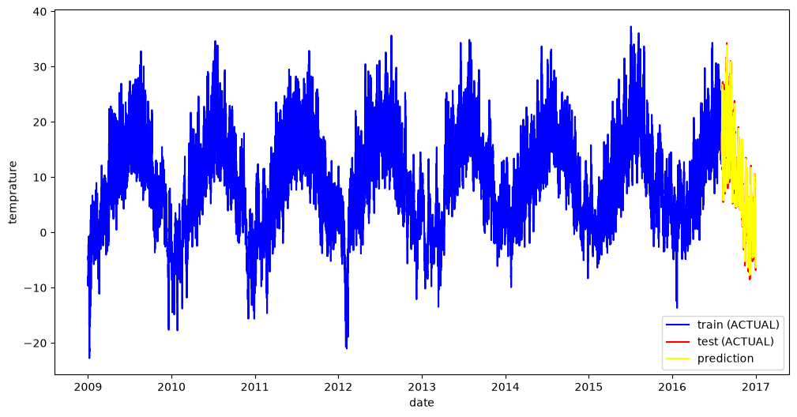

# Temprature prediction using LSTM 
  This project implements an LSTM-based deep learning model to predict future temperature values using historical hourly temperature data.

  The dataset includes the temprature of each hour from (2009 to 2017).

 ## Data Preprocessing

- StandardScaler
- Sliding Window
- Train-Test Split

  ## Model Architecture: 

     the model includes four layers and an output layer :

         1. LSTM Layer 1: (a).Takes the input sequence of past temperature values.
                           (b).Learns temporal dependencies in the data.
                           (c).Produces a hidden representation of 64 features for each time step.
         2. LSTM Layer 2: (a).Receives the output sequence from the first LSTM layer.
                           (b).Learns higher-level temporal patterns.
                           (c).Outputs a 64-dimensional hidden representation for the final prediction.

         3. Dense layer 1: Applies a fully connected layer with ReLU activation to learn nonlinear relationships from the extracted temporal features.

         4. Dropout regularisation layer : it helps reduce overfitting of the model by randomly dropping 50 % of the neurons
               
         5. Final output layer : it consiists of a single output neuron that predicts the temprature 

    ## Model flow : 
            
              Temperature Sequence
                        │
                        ▼
                   LSTM (64)
                        │
                        ▼
                   LSTM (64)
                        │
                        ▼
                   Dense (ReLU)
                        │
                        ▼
                 Dropout (0.5)
                        │
                        ▼
                   Dense (1)
                        │
                        ▼
           Predicted Temperature
        
## Model Configuration

• Input Feature: Temperature
• Sequence Length: 24 hours (or whatever you used)
• Hidden Size: 64
• Number of LSTM Layers: 2
• Dropout Rate: 0.5
• Loss Function: Mean Squared Error (MSE)
• Optimizer: Adam

## Prediction results :
 the following graph includes comparision between actual and predicted temprature :

  
